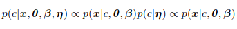
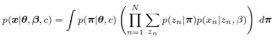

# A Bayesian Hierarchical Model for Learning Natural Scene Categories

## Abstract
-   本篇論文提出 novel approach 以 learn/recognize 自然景觀的類別
    -   不需要透過專家作標註
    -   以 local regions 去 represent image of a scene
        -   稱為 codeword，由 unsupervised learning 學到
    
    -   每個 region 被表示為 theme 的一部份
        -   過去這些 theme 是從專家標註的 annotation 學到
        -   本篇論文則可以不需要監督，學到 codewords 的 distribution

-   在 13 種複雜場景的 large set 上有滿意的分類表現

## Introduction
1.  human 能夠輕易地分類複雜的自然場景
    -   要分辨場景，必須要先分辨 object 然後分類場景的類別

2.  是否能夠在沒有分辨出 object 的情況下看出場景的 context 呢
    -   classify indoor/outdoor
    -   city/landscape
    -   sunset / mountain / forest
        -   global cues (power sprctrum, color histogram)
        -   local spatial constraints
        -   intermediate representations
            -   intermediate properties

3.  intermediate representations 是很有用的資訊，但耗費 high human labor
    -   能否從 data 直接 learn 出來

4.  傳統的 texture models 會先 identify 一個大型 textons/codewords dictionary
    -   對每一個類別的 texture，學習一個 model 來捕捉 textons 的 distribution
    -   texture 可以看作是一個 complex scene 的 intermediate representation
    -   需要 manually segment training example

    -   hard assignment class 的 distribution 可能不準確
        -   tree 不一定佔有 30%, house 不一定佔有 60%
        -   suburb scene 可能有較多樹

5.  因此過往的研究會使用 intermediate representations(textures, mixture of textons, codewords)
    -   本篇論文的目標是利用這些 insights，但避免使用 manually labeled/segmented 來 train system
    -   Blei 的 framework 中， local regions 會先被 cluster 成不同的 intermediate themes，再分成不同的 categories
        -   local regions 的 probability distribution 和 intermediate themes 都會同時被學到

        -   不需要 human annotation

6.  本篇論文的 contribution
    -   without supervision
    -   principled probabilistic framework，使用 histogram models, textons 都是本篇論文的特例

    -   本篇論文的 model 可以將 images 的 categories 聚集成 sensible hierachy

## 2. Our Approach
-  本篇論文將 image model 成 local patches 的組成
    -   每個 patch 都由 codeword represented
    -   codeword 來自 large voabulary
    -   learning 的目標為用 codeword 在每個 scene 中最好地 represent 出 distribution
        -   recognition 時，首先 identify 所有的 unknown image 中的所有 codewords
        -   predict 特定 image 時，再找 fit 其 codewords distribution 最好的 category model
        -   主要是基於 Latent Dirichlet Allocation (LDA)
            -   引入 category variable for classification
            -   提出了兩個 model 變形

-   

### 2.1 Model Structure
1.  經由 generative process 以建立特定 category 的 scene
    -   先選取 category label(例如 mountain scene)
    -   給定 mountain class, 我們畫出 probability vector
        -   決定 generating scene 中的每個 patch 時要選擇什麼樣的 intermediate themes

    -   當建立每個 patch 時，先決定特定的 theme
        -   例如 rock theme
        -   這會 privilege 比較常出現在 rock 上的 codewords (像是 slanted lines)
        -   如果 theme 比較 prefer 橫線，則可以用 horizontal line segment 的 codeword
    
    -   重複 drawing theme 和 codeword 的 process，則最後可以得到 bag of patches
        -   這些 patches 可以用來 construct scene of mountain

#### 2.1.1 The Theme Models
1.  從 Theme Model 1 的 notations 和 definitions 開始
    -   patch x 是 image 的基本單位
        -   由 dictionary 中的 codewords，index 為 {1,...,T}
        -   dictionary 中的第 t 個 codeword 由 T-vector x 表示
            -   xt = 1
            -   xv = 0, v != t
    
    -   image 是 N 個 patches 組成的 sequence
        -   x = (x1,x2,...,xN)
            -   xn 是 image 的第 n 個 patch

        -   codeword 就像是 word
        -   image 就像是 document
    
    -   category D 是 I 個 image 組成的 category
        -   D = {x1,x2,...,xI}
        -   就像是 corpus

2.  接著我們寫下 model 生成 image i 的 process
    -   為每個 image 選擇 category label c
        -   c = {1,...,C}, C 為 categories 總數
        -   
            -   eta 為 multinomial distribution 的 C-dimensional vector
    
    -   對此隸屬於 category c 的 particular image，我們要 draw a parameter 來 determine intermediate themes 的 distribution
        -   例如說 foliage, water, sky 在 scene 中是如何分佈的
        -   
            -   對每張 image 都選取一個 pi
            -   pi 是用以選取 themes 的 multinomial distribution 的 parameter
            -   theta 是 C x K 的 matrix
                -   theta_c 為 K-dimensional Dirichlet parameter conditioned on category c
                -   K 為 themes 的總數
    
    -   對 image 中的每 N 個 patches xn
        -   選取 theme zn ~ Mult(pi)
            -   zn 為 K-dim unit vector
            -   zn^k = 1 表示第 k 個 theme (例如 rock theme) 有被選到
        -   xn ~ p(xn | zn, beta)
            -   beta 為 K x T 大小的 matrix
                -   K 為 themes 的數量
                -   T 為 codebook 中 codewords 的數量
            -   因此有
                -   

3.  K-dimensional Dirichlet random variable pi 
    -   有此性質
        -   pi{i} >= 0
        -   sum{i=1}{K} pi{i} = 1
    -   為 conjugate distribution of multinomial distribution

    -   因為 themes z 被描述成 multinomizal distribution 上的 discrete variable，因此 Dirichlet distribution 自然可以描述 pi 的 distribution
        -   
            -   給定 theta, eta, beta, 可以寫出 model 完整的 generative equation
                -   joint probability of theme mixture pi
                -   N 個 themes 所成的集合 z
                -   N 個 patches x
                -   category c
    
    -   

4.  Theme Model 1 是 hierarchical representation of the scene category model
    -   Dirichlet parameter theta 是 category-level parameters
        -   sample 一次並生成 category of scenes

    -   multinomial variable pi 為 scene-level variables，每張 image sample 一次

    -   discrete theme variable z 和 patch x 為 patch-level variables，每當 patch 生成時 sample 一次

5.  如果我們希望為每個 category model intermediate themes 且不在所有 categories 中共用它們
    -   引入 link between class node c to each patch xn
        -   

#### 2.1.2 Bayesian Decision
1.  給定一個 unknown scene, decision 是如何下的呢
    -   unknown image 會先 represented 成 collection of patches, codewords
    -   令 x 為 image of N patches
        -   給定 x，我們計算 probability of each scene class
        -   
            -   theta, beta, eta 皆為從 training set learn 出來的
            -   p(c|eta) 皆假設是 uniform distribution p(c) = 1/C
                -   因此會忽略估計 eta
    
    -   decision of category 是比較 x 和每個 category 的 likelihood 來作
        -   c = argmax{c} p(x|c, theta, beta)
        -   p(x|c, theta, beta) 通常利用積分得到
            -   

#### 2.1.3 Learning: Variational Inference
1.  在 learning 的過程，我們的目標是 maximize log likelihood term
    -   
        -   estimating optimal theta, beta
    -   使用 Jensen's 不等式，可以 bound 住 log likelihood
        -   
            -   q(pi, z|gamme, phi) 可以是任意的 variational distribution

    -   令 L(gamma, phi; theta, beta) 為 RHS，可得到
        -   
            -   RHS 的 second term 為兩個 probability densities 的 Kullback-Leibler distance
            -   maxmizing lower bound L(gamma, phi; theta, beta) 等同於 minimizing variational posterior probability 和 true posterior probability 的 KL distance

2.  給定                     
    -   
    -   我們會先估計 variational parameter gamma 和 phi
        -   替換 variational lower bound 成 marginal likelihood
        -   以 iterative algorithm 在兩個 steps 中替換直到收斂
            -   (E-step) 對每個 class 的 image，將 variational parameters gamma 和 phi 的值 optimize
                -   
                    -   i 為 image index
                    -   n 為 patch index
                    -   digamma function
            
            -   (M-step) Maximize resulting lower bound on log likelihood
                -   with respect to model parameters theta/beta

#### 2.1.4 A Brief Comparison
1.  我們能夠比較此 hierarchical model 與傳統 texton model 在 texture recognition 的差別
    -   給定 textures 的 class，只有一個 multinomial parameter beta 和此 class 有關

    -   生成一個 image，所有的 patches 都是從單一的 theme 中取出。如果所有的 training data 都是從單一 theme 中手動 segment 出來，則不會有問題

2.  此 framework 可以往下延伸
    -   從不同的 lighting 和 view point conditions 為相同 category 的 textures train 不同的 model

### 2.2 Features & Codebook
1.  在 theme model 中，我們將每一張 image 表示成 detected patches 的 collection
    -   每一個都 assign large dictionary of codewords

#### 2.2.1 Local Region Detection and Representation
1.  以往在 natural scene categorization 上的研究多半是 focus 在 global features，像是 frequency distribution, edge orientations 和 color histogram。現在 local regions 則逐漸展現 powerful cues。
    -   跟 global features 相比，local regions 對於 occlusions 和 spatial variations 更加 robust

2.  本篇論文嘗試了四種 extract 出 local regions 的方法
    -   Evenly Sampled Grid
        -   evenly sampled grid 以 10x10 的大小從給定的 image 中 sample 出來。
        -   patch 則 randomly sampled，scale 在 10-30 pixels 間

    -   Random Sampling
        -   每個 image 隨機 sample 出 500 個 patches，patch 的 size 則在 10-30 pixels 之間隨機取出

    -   Kadir & Brady Saliency Detector
        -   100-200 在 location 和 scale 上都較為顯著的 regions 會以 saliency detector 取出。每個 interest point 的 scale 在 10-30 pixels 間

    -   Lowe's DoG Detector
        -   大約 100-500 個在不同 scale 上 stable 且對 rotation 免疫的 regions 會被以 DoG detector 取出。每個 interest point 的 scale 約為 20-120 pixels。

3.  本篇論文使用了兩種 representations 來 describe 一個 patch
    -   normalize 後的 11x11 pixel gray value
    -   128 維 SIFT vector

#### 2.2.2 Codebook Formation
1.  給定 training images 中所有 categories 的 detected patches
    -   使用 K-means 學出 codebook
    -   太少 member 的 cluster 會刪去
    -   codeswords 就會以 cluster 的 center 來命名

2.  此圖為 174 codewords，從 gray value pixel learn 出來
    -   

## 3. Dataset & Experimental Setup
1.  本篇論文使用的 dataset 包含 13 個 natural scenes 的類別
    -   high way            260 images
    -   inside of cities    308 images
    -   tall buildings      356 images
    -   streets             292 images
    -   suburb residence    241 images
    -   forest              328 images
    -   coast               360 images
    -   mountain            374 images
    -   open country        410 images
    -   bedroom             174 images
    -   kitchen             151 images
    -   living room         289 images
    -   office              216 images

2.  image 的平均 size 為 250x300 pixels
3.  每一個 category 的 scenes 都會隨機分成兩個 separate sets of images
    -   N(100) for training, 剩下 for testing
    -   codebook of codeward 是從整個 training set 隨機抽出一半的 patches 訓練出來的
    -   每個 category 的 model 從 training images 中取得

4.  當有一張 test image 要被 categorize 時
    -   會依據最高的 likelihood 來下 decision
    -   confusion table 用以評估 model 的 performance
        -   x 軸表示每個 category of scene 的 models
        -   y 軸表示 ground truth categories of scenes
        -   scene categories 的 orders 皆相同
        -   理想情況下，應該要有一條全白的對角線顯示出良好的 discrimination power
            -   Results 則以 diagonal entries 的平均值作 performance

5.  從各個 category 中學到的 model 的 internal structure
    -   
    -   每一列為一個 category
    -   left panel 為 40 個 intermediate themes 的 distribution
    -   right panel 為 codewords 的 distribution
        -   同時 show 出 top 20 most likely codewords for the category model 的 visualization

6.  各個 category 的 test images
    -   
    -   每一列為一個 category
    -   前3個 column 為 3 個正確 recognized 的 images, 最後一個 column 為不正確的 recognized
    -   疊加在圖上的是 samples of patches
        -   這些 patches 屬於 most significant set of codewords of the model
    
    -   可注意到在不正確分類的 images 上，significant codewords of the model 的數量傾向於較少