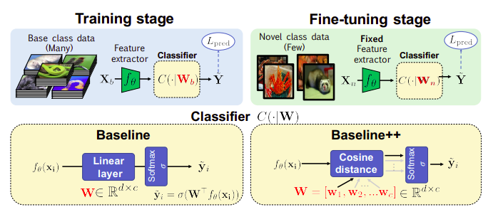
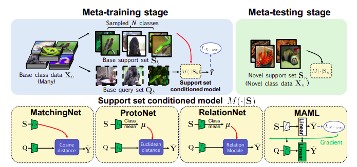

# A CLOSER LOOK AT FEW-SHOT CLASSIFICATION
## Novelties, contributions, assumptions
1.  本篇 paper 提出較一致的分析，以 deeper backbone 來減少不同 domain 之間的 performance 差異
    -   在 domain difference 不是太多的情況下，deeper backbone 皆可以做到不錯 performance
    -   shallow backbone 可能需要減少 intra-class variation，但 deep backbone 則相對不重要

2.  於 miniimagenet 和 CUB dataset 上以 modified baseline method 取得 state-of-art 的表現
    -   使用 distance-based classifier 取代 linear classifier

3.  新的 experiment setting 來評估 cross-domain generalization ability
    -   設計新穎的 evaluation 方式，使 base class 與 novel class 會從不同的 domains 中 sample 出來

## Questions and promising applications
1.  few shot learning 用於有 labeled 的 examples 數量偏少的情況
2.  recognize 出 unseen 的 classes

## Technical summary
1.  給定數量充足的 base class Xb 與少量的 novel class Xn，few shot learning 的目的是要訓練一個能分類 Xn 的 classifier
    -   novel classes 在 training 時沒有看過，labeled example 很少

### Baseline
1.  本篇論文中的 baseline method 以標準的 transfer learning (pretrain + finetune)
    -   Training stage:
        -   以 softmax 訓練 feature extractor 
    
    -   Fine-tuning stage:
        -   fix 住 feature extractor 的參數，並且用 novel class 的 example 與 softmax 訓練一個 new classifier

### Baseline++
1.  在 training 時減少 intra-class variation
2.  Baseline++ 的 training 與 Baseline 相同，僅僅差異在 classifier 設計
    -   Baseline++ 將 classifier 設計成 W = [w1, w2, ..., wc]
    -   以各個列向量與 x 的 feature f(x) 進行內積取得 cosine similarity score [s1, s2, ..., sc]
    -   利用這些 cosine similarity score 丟入 softmax 中分類

3.  [w1, w2, ..., wc] 可稱為 prototype
    -   分類是基於 feature 與 prototype 之間的 cosine similarity

### META-LEARNING ALGORITHMS
1.  Vinyals et al. 定義 few-shot learning 為 meta-learning
    -   在 support set S 上
    -   learn to learn from a given small support set S

2.  包含 meta training 與 meta testing 兩大 stage
    -   meta training
        -   隨機選出 N 個 classes
        -   隨機切分成 support set Sb 以及 query set Qb
        -   找出能夠 minimize N-way prediction loss 的 model
    
    -   meta testing
        -   所有 novel class data Xn 可以被視為 support set for novel classes Sn
        -   classifier M 可以學習用 new support set Sn 來 predict novel class

3.  不同的 meta learning method 採用不同的方式從 support conditioned 作 prediction
    -   MatchingNet 和 ProtoNet 比較每個 class 中 query 與 support feature 的 distance
        -   MatchingNet 用 average cosine distance
        -   ProtoNet 用 average euclidean distance
    
    -   RelationNet 將 distance 換成 learnable relation module

