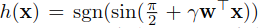
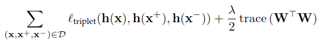
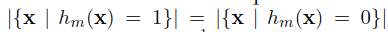

# A Survey on Learning to Hash
## Abstract
1.  Nearest Neighbor search problem 是在 database 中找尋和 query point 距離最短的點
    -   Learning to Hash 則是此 problem 的其中一個主要的 solution

2.  本篇論文將 survey learning to hash algorithm
    -   依據 preserve similarity 的方式分類為
        -   pairwise similarity preserving
        -   multiwise similarity preserving
        -   implicit similarity preserving
        -   quantization

## 1. Introduction
1.  Nearest Neightbor search，又稱為 similarity search，proximity search，code item search
    -   用以找尋一個 item (nearest neightbor)
    -   在 database 中，於特定的 distance metirc 下與 query item 距離最近

2.  當 database 很大時，將每一個 item 和 query point 計算一個距離將耗費大量時間
    -   approximate nearest neightbor search 將更有效率且足夠應付實際情況

3.  Hashing 為一個 approximate nearest neighbor search 常用的 solution
    -   transform data item 到 low-dimensional representation，或是 bits sequence 組成的 short code (hash code)

    -   hashing algorithm 有兩種主要的類別
        -   locality sensitive hashing
            -   data independent
            -   用於 fast object detection, image matching
        -   learning to hash

4.  Learning to Hash 為本篇論文重點。
    -   data dependent
    -   從特定的 dataset 中 learn 出 hash functions 使得 nearest neightbor 在 hash coding space 的搜尋結果和 original space 盡可能接近

    -   由 Hamming distance 與 original space distance 間的關係得出靈感，例如 SimHash

    -   semantic hashing 與 spectral hashing 則試著學習 projection vector，而非 random projections

5.  Learning to Hash 中最主要的詞彙為 similarity preserving
    -   將 original space 和 hash coding space 之間的 similarity 差異縮至最小
    -   本篇論文則依照 similarity preserving 的方式分類
        -   pairwise
        -   multiwise
        -   implicit
        -   quantization
    
    -   end-to-end 而不是先 learn representation 再從 representation learn 出 hash code

## 2. BACKGROUND
### 2.1 Nearest Neighbor Search
1.  Nearest neightbor search 的目標是 search 一個 item NN(q)
    -   q 為 query item
    -   NN(q) 屬於 item set X = {x1,x2,...,xN}
    -   NN(q) = argmin dist(q,x)
    -   最直接的作法為 K-nearest neighbor search

2.  典型的情況為 database X 是落在 d-dimension 空間，distance 是用 ls-norm 計算
    -   

3.  現存在 low-dimension 的 Nearest Neighbor Search algorithms，如同 k-d trees
    -   在高維度可能會變得沒有效率，甚至比 linear scan 還有更高的 cost
    -   因此有更多 approximate algorithm 出現
        -   error-constrained nearest nearest neighbor search
        -   time-constrained nearest neighbor search
            -   限制搜尋的時間，時間到了就停止搜尋直接回傳結果，用於 real time application
            -   目標為縮小所回傳的 K nearest neighbor 和 K 個 exact neighbor

### 2.2 Search with Hashing
1.  hashing 是將 reference items 映射到 target items 使得 nearest neighbor search 的結果足夠準確
    -   target item 為 hash code / hash values / hashes

2.  hash function 可定義為 y = h(x)
    -   y 為 hash code
        -   可以是 integer,
        -   可以是 binary value (0,1)/(-1,1)

    -   實務上可能會用多個 hash function 混合，形成 compound hash code
        -   Y = h(X)
        -   Y = [y1, y2, ..., yM]
        -   h(X) = [h1(x), h2(x),..., hM(x)]

3.  使用 hash codes 進行 neareset neighbor search 有兩種基本策略
    -   hash table lookup
    -   hash code ranking

4.  hash table lookup 加速 search 的方式主要為減少 distance 計算
    -   用 hash table
        -   由 bucket 組成
        -   bucket 是由 hash code 進行 index
        -   每個 reference item x 會被放到編號 h(x) 的 bucket
    
    -   hashing approach 目標是 maximize 在 original space 中距離相近的 items 碰撞的機率。同時 minimize 距離遠的 items 碰撞的機率

    -   reranking
        -   從 database 拿出 nearest neighbor 之後可能會再以 orignial space 的 distance 作 reranking

5.  為了增進 recall，有兩種作法可以採用
    -   visit 更多 buckets，hash code 接近 h(q) 的 bucket 皆檢查看看

    -   創建更多的 hash table
        -   若有 L 個 hash table，則當有 query item q，可 retrieve 出 h1(q), h2(q),..., hL(q)
        -   可再依據 hits 的數量來 retrieve
    
    -   L 個 hash code y1, y2, ..., yL 皆應該為相當長的 code

6.  第2種方法創建許多 hash table，每個 reference item 有很多 copy，但第1種方法也會需要 access 更多 bucket

7.  Hash code ranking 會對 hash distance 作 exhaustive search
    -   將所有 hash distance 都比過一次
    -   之後再挑其中幾個出來用 original space distance reranking
    -   利用 hash codes 的距離通常比 original space 的距離計算更 efficient 這點來加速

-   

## 3. Learning to Hash
1.  Learning to hash 的目標是 learn 一個 compound hash function y = h(x)
    -   將 x 映射到 compact code y

2.  Learning to hash 需要考慮五件事情
    -   採用什麼樣的 hash function h(x)
    -   在 coding space 需要使用什麼 similarity
    -   在 input space 需要使用什麼 similarity
    -   loss function
    -   optimization technique

### 3.1 Hash Function
1.  Hash function 可以 based on 
    -   linear projection
    -   kernels
    -   spherical function
    -   neural network

2.  linear hash function
    -   
        -   w 為 projection vector
        -   b 為 bias variable
        -   sgn 為正負號函數

3.  kernel hash function
    -   
        -   {st} 為 representative samples，是隨機從 dataset 中取出的 cluster centers

        -   {wt} 為 weight

4.  non-parametric function
    -   
        -   {ci} 是 centers 所成集合，通常是由 K-means 等演算法得到

5.  linear function 較有效率，kernel function 或 nearest vector assignment 則較準確

### 3.2 Similarity
1.  do(ij) 是 input space 中 pair (xi, xj) 的 distance
    -   o 表示 original
    -   可以是 euclidean 或是其他 metric
    -   similarity 則可以用 Gaussian function 從 distance 中得到
        -   

2.  cosine similarity
    -   

3.  hamming distance
    -   
    -   不一樣的 bits 數量
    -   similarity sh(ij) 則直接定義成 
        -   sh(ij) = M - dh(ij)
    
    -   若 codes value 是 1 和 -1，則 hamming similarity 也能直接寫成
        -   
    
    -   加上 weight 的話
        -   
        -   lambda 為 Diag(lm1, lm2, ..., lmM)
            -   是 hash code 每一位的 weight

4.  euclidean distance

### 3.3 Loss Function
1.  設計 loss function 的規則為
    -   preserve similarity order
    -   minimize input space 的 search result 和 hash codes space 之間的 gap

2.  廣泛使用的是 
    -   pairwise similarity preserving
        -   讓每一對 pair 在 original space 和 coding spaces 的 distance/similarities 盡量一致
    
    -   multiwise similarity preserving
        -   讓 multiple items 在 original space 和 coding spaces 的 distance/similarities 的 order 盡量一致

### 3.4 Optimization
1.  optimizing hash function parameter 最大的挑戰有兩個
    -   sgn function
        -   mixed-binary-integer optimization problem

    -   time complexity
        -   大量的資料，通常只能 sample 出 subset of points

2.  handle sgn function 的方式
    -   採用 continuous relaxation
        -   sigmoid relaxation
        -   tanh relaxation
        -   droppint sign function sgn(z)~z
    
    -   two-step scheme
        -   alternative optimization: optimizing binary codes without considering hash function，並且從 hash codes 估計 function parameters
    
    -   discretization
        -   將 sign function sgn(z) drop 成 z
        -   將 hash code 作為 hash function 的 approximation

### 3.5 Categorization
1.  algorithms 可以分類成各式種類
    -   pairwise similarity preserving class
    -   multiwise similarity class
    -   implicit similarity preserving class
    -   quantization class
        -   quantization-based hashing

## 4. PAIRWISE SIMILARITY PRESERVING
1.  將 pair of items 在 input space 和 Hamming Coding Space 的 distance/similarities 儘量相近
    -   Similarity-distance product maximization
    -   
    -   Similarity-similarity production maximization
    -   
    -   Distance-distance production maximization
    -   

    -   Distance-similarity production minimization
    -   

    -   Similarity-similarity difference minimization
    -   

    -   Distance-distance difference minimization
    -   

    -   Normalized similarity-similarity divergence minimization
    -   
    -   input space 和 coding space 內的 similarity 都經過 normalize
    -   
    -   

### 4.1 Similarity-Distance Product Minimization

#### 4.1.1 Spectral Hashing
1.  spectral hashing 的目標為 minimize 此 object
    -   
    -   其中 hash space 使用的是 Euclidean distance
    -   
    -   input space 的 similarity 如下定義
    -   

2.  可以將 objective function 寫成矩陣型式
    -   
    -   Y = [y1,y2,...,yN] 為 MxN 矩陣
    -   S = [so{ij}]NxN 為 similarity matrix
    -   D = diag(d11,...,dNN) 為對角矩陣
        -   

3.  為避免 trivial solution y1=y2=...=yN
    -   code balance condition 被引入
    -   map 到各個 hash code 的 data item 的數量會儘量一樣
    -   bit balance 使每個 bit 都有 50% 的機率為 0/1
    -   bit uncorrelation 表示不同的 bit 之間是無關的
    -   

4.  hashing algorithm
    -   從 N 個 d 維的 reference data item 中 find principle component (PCA)

    -   在每個 PCA directions 以 M 個最小的 eigenvalues 上計算 M 個 one-dimenstional Laplacian eigen functions
    
    -   從 Md 個 eigenfunction 中選 M 個 eigen values 最小的 eigenfunctions
    
    -   用 0 來對 eigenfunction 作 threshold，得到 binary code

5.  uniform distribution 在 [rl, rr] 上的 one-dimensional Laplacian eigenfunction 是
    -   phi_m(x) = sin(pi/2 + m*pi / (rr-rl) *x)

    -   lambda_m = 1 - exp(-ep^2/2 |m*pi / (rr-rl)|^2), m = 1,2,...
        -   是對應的 eigenvalue
        -   m 是 frequency
    
    -   hash function 通常寫成
        -   
        -   gamma depends on frequency m 以及往 w 方向 project 的 range

6.  此方法在 short hash code 上表現不錯，但在 long hash code 上則較差
    -   data 為 uniform distribution 的假設未必成立
    -   eigenvalue 的單調遞減會和下式有關
        -   
        -   因此 large spread |rr-rl| 且 low frequency m 的 PCA direction 較好
        -   用 0 來 thresholding eigenfunction 可能會使得相近的 point 被 map 到不同的 hash value，但較遠的 point 卻可能被 map 到相同的 hash value，意即 hamming distance 不完全和 input space distance 一致

#### 4.1.2 Variant
1.  Linear discriminant analysis (LDA) hashing 會 minimize 此 loss function
    -   
    -   dh{ij} = |yi - yj|^2
    -   不同於 spectral hashing 的是
        -   so{ij} = 1，若 xi, xj 是相似的 pair
        -   so{ij} = -1，若 xi, xj 不相似
        -   使用 linear hash function
            -   
        -   使用 weight alpha 在 similar pair 上
            -   

2.  projection matrix W 和 threshold b 會被分開來 optimize
    -   估計 orthogonal matrix W
        -   drop 掉 sgn function
        -   化為 eigenvalue decomposition problem
    
    -   fix W 然後估計 b
        -   1D scheme search minimize 上式

3.  minimal loss hashing 的 loss function 同樣為
    -   
    -   和 LDA hashing 一樣
        -   so{ij} = 1，若 xi, xj 是相似的 pair
        -   so{ij} = -1，若 xi, xj 不相似
    
    -   不同的是
        -   distance 是 hinge-like
            -   xi,xj 相似
                -   則 dh{ij}=max(|yi-yj_1+1, rho)

            -   xi,xj 不相似
                -   則 dh{ij}=max(|yi-yj|_1-1, rho)

        -   rho 為 Hamming space 用以區分 pair 的 threshold
        -   lambda 為 penalty 的 ratio
        -   hash function 也是 linear form

### 4.2 Similarity-Similarity Product Maximization
1.  Semi-supervised hashing 為 representative algorithm。
    -   objective function 為
    -   
    -   input space 的 similarity :若 xi 和 xj 為同一個 class，則 so{ij} 為 1，否則為 -1
    -   coding space 的 similarity 則定義為 sh{ij} = yi^Tyj，故 objective function 為
    -   

2.  hash function 也是 linear form
    -   bit balance trace(YY^T) = 0
        -   maximize variance
    -   Y1 = 0
    -   因此 overall 的 objective function 為
    -   

### 4.3 Distance-Distance Product Maximization
1.  目標函數為最大化
    -   

2.  topology preserving hashing
    -   
    -   Ld = Diag{Do1} - Do
        -   Do = [do{ij}]NxN

3.  similarity-distance product minimization 也同時考慮到
    -   
    -   alpha*I 是 regulaeization term
    -   trace(YY^T) 最大化 variance

### 4.4 Distance-Distance Difference Minimization
1.  Binary reconstructive embedding 屬於這個類別
    -   

2.  Euclidean distance 同時用在 input space 和 coding space
    -   

3.  使用 kernel function
    -   
        -   {smt}_t=1^Tm 為 sampled data items
        -   K(.,.) 為 kernel function
        -   {wmt} 為 weight to be learnt

4.  由此簡單的推導，可以看出 distance-distance difference minimization 和 distance-distance product maximization 的差異在於交叉項
    -   
    -   max sum(do{ij}*dh{ij})

### 4.5 Similarity-Similarity Difference Minimization
1.  mathematically formulated
    -   
2.  supervised hashing with kernels 使用以下 objective function
    -   
    -   so{ij} = 1, if (i,j) is similar
    -   so{ij} = -1, if dissimilar
    -   y = h(x) 為 kernel hash function

3.  以下推導可發現 similarity-similarity difference minimization 和 similarity-similarity product maximization 差在平方項
    -   
    -   min sum(sh{ij}^2)

### 4.6 Normalized Similarity-Similarity Divergence Minimization
1.  Spec hashing 屬於這個類別
    -   將每個 data items 視為 sample
    -   將他們的 normalized similarity 視為 probability
    -   找尋一個 hash function 使得 input space 的 probability distributions 和 output space 良好對齊

    -   objective function
        -   
        -   so{ij} 是 normalized similarity in input space
            -   sum so{ij} = 1 (經過 normalize)
        -   sh{ij}  = 1/Z * exp(-lambda*dh{ij})
            -   Z 為 normalization variable Z = sum exp(-lambda *dh{ij})

## 5. Multiwise Similarity Preserving
1.  此 section 回顧 hashing algorithms
    -   採用 maximizing similarity orders agreement 於 input space 和 coding space
    -   超過 2 items 的 orders

2.  Order preserving hashing
    -   align orders in original space and coding space
    -   給定 data point xn
        -   database points X 被分成 (M+1) 個 categories (Ch{n0}, Ch{n1}, ..., Ch{nM})
            -   Ch{nm} 為到給定 points 的距離為 m 的 items
        
        -   同樣以 original space 的 point 也定出 (Co{n0}, Co{n1}, ..., Co{nM})

    -   objective function 如以下定義
        -   
        -   |Co{nm} - Ch{nm}| 為兩個 set 的 difference 的 cardinality
        -   linear hash function h(x)

3.  Triplet loss hashing 會 maximizing 在 items triplets 上的 similarity order agreement
    -   {(x, x+, x-)}
    -   (x,x+) 較 (x,x-) similar
    -   triplet loss
        -   
    
    -   objective function
        -   
        -   h(x) = h(x;W) 為 compound hash function

4.  Listwise supervision hashing 同樣使用 triplets of items
    -   將 triplet 組成 triplet tensor So
    -   
    -   objective function
        -   
    -   sh{ijk} 為 ranking triplet，以 binary code 的 cosine similarity 計算得到
        -   sh{ijk} = sgn(h(qi)^Th(xj) - h(qi)^Th(xk))
    
    -   drop 掉 sgn function，則可得到
        -   

## 6. Implicit Similarity Preserving
1.  此類的 hash algorithm 專注於 space partitioning 而不是直接以 input space 及 coding space 的 distance/similarity 來作 evalutate
    -   最常見的作法為 partition the space，形成 classification problem
    -   maximum criterion 和 code balance condition

2.  Random maximum margin hashing
    -   learn 一個 hash function 以得到 maximum margin
    -   隨機 sample N 個 data items 並且隨機 label 一半為 1，另一半為 -1
    -   採用 standard SVM formulation
    -   
        -   {xi+} 為 positive samples
        -   {xi-} 為 negative samples
    -   使用 SVM learn 到的 hyper-parameter 來 form hash function

3.  Complementary projection hashing
    -   希望 items 能夠盡可能遠離 hash function 的 partition plane
    -   
    -   H(.) = 1/2*(1+sgn(.)) 為 unit step function

    -   bit balance : Y1 = 0
    -   bit uncorrelation : YY^T 的非對角元素為 0
    -   當 learn 第 m 個 hash function 時，data item 會被乘以一個 weight，此 weight 從第 (m-1) 個 hash function 得到

4.  Spherical hashing 使用一個 hypersphere 來 partition space
    -   h(x) = 1, if d(p,x) <= t
    -   h(x) = 0, otherwise
    -   compound hash function 將由 M 個球組成。
        -   M pivots {p1, p2, ..., pM}
        -   M thresholds {t1,...,tM}
    
    -   coding space 的 distance 是由下式定義
        -   
    
    -   不對 similarity 的 disagreement 作 penality， M 個 pivot 和 thresholds 是利用以下 bit balance condition 學到
        -   
        -   

## 7. Quantization
1.  以下推導可得出 quantization approach 可以由 distance-distance difference 推出
    -   distance reconstruction error 會被 quantization error bound 住
    -   考慮兩個 point xi, xj 以及他們的 approximations zi, zj
        -   
    
    -   因此，minimize distance-distance difference 即為 minimize 它的 upper-bound， quantization error

2.  Theorem 1
    -   quantization approach 的 distortion error 是 input features 與它的 approximate representation pairwise distances 的 upper bound

    -   Hypercubic quantization
        -   approximation z 與 hash code y 相等
    -   Cartesian quantization
        -   z 是 vector formed by hash code y

### 7.1 Hypercubic Quantization
1.  Hypercubic Quantization 代表將 data item 計量成 hypercubic 中的 vertex，也就是落在 set {[y1, y2, ..., yM]^T | ym in {-1, 1}} 的向量
    -   目標是設計一個 measurement matrix A 以及 recovery algorithm 使得 k-sparse unit vector x 可以有效從 linear measurements 的 sign recovered
    -   b = sgn(Ax)
        -   hypercubic quantization 要從 input x 找到 matrix A 以及 code b
    
    -   minimizing |xi-yi|^2
        -   yi in {1, -1}

#### 7.1.1 Iterative quantization
1.  用 PCA preprocessing data 到 M dimenxions
    -   v = P^Tx
        -   P 為 d x M (M <= d)，以 PCA 得到
    
    -   formulation
        -   
        -   R 為 M x M Rotation Matrix
        -   V = [v1 v2 ... vN]
        -   Y = [y1 y2 ... yN]

    -   採用 alternative optimization 來解決此問題
        -   分成兩個 alternative steps
            -   Fixing R, Y = sgn(R^TV)
            -   Fixing B, R = S'S^T
                -   S' 和 S 是從 YV^T 的 SVD 得到的 YV^T = SLS'^T

#### 7.1.2 Extensions and Variants
1.  Harmonious hashing 將 iterative quantization 作調整，加上一個額外的 constraint
    -   YY^T = sI
        -   relaxing Y to continuous values
    -   fixing R, R^TV = ULV^T
        -   Y = s^(1/2)UV^T
            -   fixing Y, R = S'S^T
            -   S 和 S' 是從 YV^T 的 SVD 中得到的 YV^T = SLS'^T
        -   hash function 為 y = sgn(R^Tv)

2.  Isotropic hashing 在 PCA preprocessing 後找尋一個 rotation 使得
    -   R^TVV^TR = S
    -   S 的對角線上元素全為同樣的值
        -   S11 = S22 = ... = SMM
    -   objective function
        -   |R^TVV^TR - Z|_F = 0
            -   Z 的所有對角線元素等於一個變數 s
        -   此問題可用 
            -   lift and projection
            -   gradient flow
            解決

    -   使 M directions 的 variance 的目標是要使 hash code 中的每一個 bits 對於 distance evaluation 的貢獻相等
        -   isotropic hashing 尋找 global rotation matrix R 使得 first M 個對角 entries of S = R^TXX^TR 相等
        -   

### 7.2 Cartesian Quantization
1.  Cartesian Quantization 意指 quantization algorithm 的 composed dictionary C 是以小 dictionary 的集合作 Cartesian product
    -   {C1, C2, ...,CP}
        -   C = C1 x C2 x ... x CP
            = {(c1{i1},c2{i2},...,c{iP})}
        -   Cp 為第 p 個 dictionary
            = {cp{0}, cp{2}, ..., cp{Kp-1}}
            -   ip in {0, 1,...,Kp-1}

2.  優點為
    -   P 個小 dictionary 共有 sum{p=1}{P} Kp 個 dictionary items，生成一個含有 prod{p=1}{P} Kp 個 items 的大 dictionary 

    -   query item q 到 dictionary item (c1{i1}, c2{i2}, c2{i3},...,cP{iP}) 的距離可以由 {dist(q, c1{i1}), dist(q, c2{i2}),..., dist(q, cP{iP})} 經由 sum operation 得到
        -   如果 query item 到 source item 的距離有事先算好，則可以 O(P) 得到 distance
    
    -   當有 N 個 database items 需要計算距離
        -   複雜度可從 Nd 降到 NP

#### 7.2.1 Product Quantization
1.  將 feature space 分割成 P 個 disjoint subspace 以取得 P 個 source dictionaries
    -   database 因而分成 P 個 sets。每個 set 包含 N 個 subvectors {xp{1}, ...,xp{N}}
    -   quantizaing 每個 subspace 形成 clusters
        -   K1=K2=...=KP=K
        -   {cp{1}, cp{2},...,cp{K}} 是第 p 個 subspace 的 cluster center
    
    -   產生 item 的方式為 concatenation P-tuple
        -   [c1{i1}^T, c2{i2}^T, ...,cP{iP}^T]^T
        -   data point 會被 assigned 到最近的 dictionary item (c1{i1},c2{i2},...,cP{iP}) 是以 compact code (i1,i2,...,iP) 表示
            -   長度為 Plog2{K}
            -   distance dist(q, cp{ip}) 是以 |qp - cp{ip}| 來計算
                -   qp 為 q 在第 p 個 subspace 的 subvector
    
    -   product quantization 可以視為 minimize 此 objective function
        -   
        -   C 為 d x PK 的 matrix
        -   
            -   Cp = [cp{1}, cp{2}, ...,cp{K}]
            -   bn = [bn{1}^T, bn{2}^T, ...,bn{P}^T]^T
                -   bnp 為長度 K 的 indicator vector，只有一個 entry 是 1，其餘皆為 0 (表示從 p 個 source dictionary 中選哪一個 element 出來作 quantization)

#### 7.2.2 Composite Quantization
1.  在 composite quantization 中，利用 sum operation 從 P-tuple (c1{i1}, c2{i2},...,cP{iP}) 產生 item
    -   sum{p-1}{P} cp{ip}

2.  為了要計算 query q 到 compose dictionary item 的距離，加入了 constraint
    -   不同的 dictionary 的 element 作 inner product 加總後必須是常數
        -   
    
    -   problem 可寫成
        -   
            -   Cp 為 d x K 的 matrix，每個 column 對應第 p 個 dictionary 的一個 element

3.  Sparse composite quantization 建立 sparse dictionary 以提升 composite quantization
    -   
    -   S 是控制 sparsity degree 的 parameter
        -   大幅減少 distance table 的 computation cost
        -   幾乎和 product quantization 一樣 efficient

#### 7.2.3 Variants
1.  給定 M 個 hash functions {hm(x)=bm(gm(x))}
    -   gm() 為 real-valued embedding function
    -   bm() 為 binarization function
    -   計算 M 個 dictionaries
        -   每個 dictionary 對應一個 hash bit
        -   
        -   b = 0 或 b = 1
    
    -   distance computation cost 為 O(M)
        -   將 hash functions 分成 groups 可以加速

### 7.3 Reconstruction
1.  quantization 可以被視為 data item 的 reconstruction approach
    -   Semantic hashing 以 deep generative model restricted Boltzmann machine(RBM) 生成 hash code 用以 reconstruct data item

2.  binary code 用以尋找 similary data
    -   從 binary codes reconstruct input vector
    -   亦有透過 linear transformation reconstruct vector from binary code 的著述
