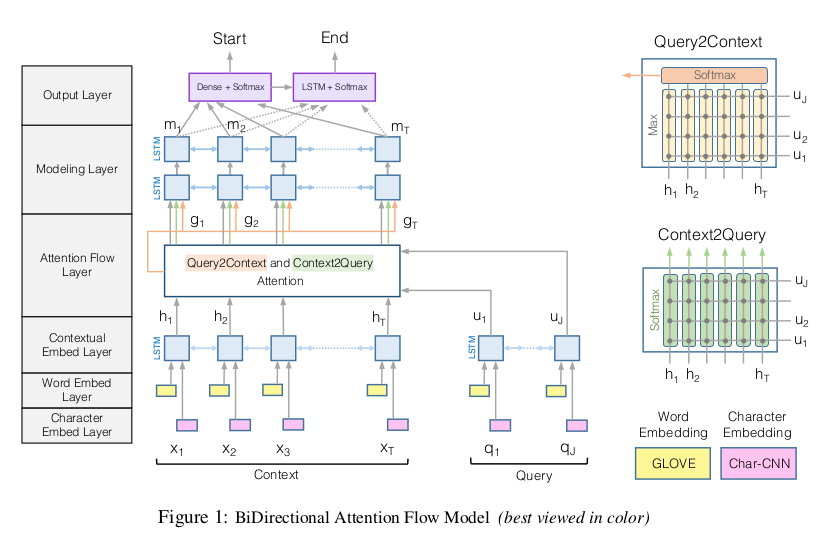

# BI-DIRECTIONAL ATTENTION FLOW FOR MACHINE COMPREHENSION
## Novelties, contributions, assumptions
1.  This paper introduce the Bi-Directional Attention Flow (BIDAF) network
    -   multi-stage hierarchical process that represents the context at different levels of granularity
    -   bidirectional attention flow mechanism to obtain a query-aware context representation without early summarization

2.  Performance (state-of-art)
    -   Stanford Question Answering Dataset (SQuAD)
    -   CNN/DailyMail cloze test

## Questions and promising applications
1.  machine comprehension (MC) and question answering (QA)
    -    natural language processing and computer vision

## Technical summary
1.  Attention layer is not used to summarize the context paragraph into a fixed-size vector
    -   along with the representations from previous layers, is allowed to flow through to the subsequent modeling layer, reduces the information loss caused by early summarization

2.  memory-less attention mechanism
    -   forces the attention layer to focus on learning the attention between the query and the context
    -   allows the attention at each time step to be unaffected from incorrect attendances at previous time steps

### Model
1.  Six Layers
    -   Character Embedding Layer 
        -   maps each word to a vector space using character-level CNNs.
    -   Word Embedding Layer
        -   maps each word to a vector space using a pre-trained word embedding model.
    -   Contextual Embedding Layer
        -   utilizes contextual cues from surrounding words to refine the embedding of the words. These first three layers are applied to both the query and context.
    -   Attention Flow Layer
        -   couples the query and context vectors and produces a set of query aware feature vectors for each word in the context.
    -   Modeling Layer
        -   employs a Recurrent Neural Network to scan the context.
    -   Output Layer
        -   provides an answer to the query.
        
