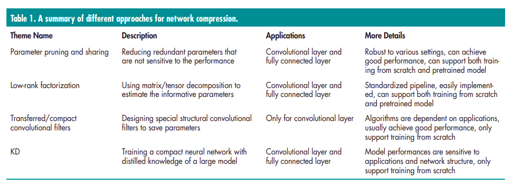
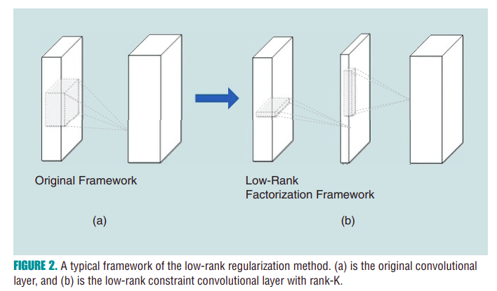

# Model Compression and Acceleration for Deep Neural Networks
## Novelties, contributions, assumptions
1.  As mentioned in the "Introduction", techniques of the four themes are orthogonal. It makes sense to combine two or three of them to maximize the compression/speedup rates. For some specific applications, like object detection, which requires both convolutional and fully connected layers, one can compress the convolutional layers with lowrank factorization and the fully connected layers with a pruning method

2.  If a problem involves small or medium-size data sets, one can try the KD approaches. The compressed student model can take the benefit of transferring knowledge from the teacher model, making it a robust data set that is not large.

3.  Usually, the approaches of pruning and sharing could give
a reasonable compression rate while not hurting the accuracy. Thus, for applications that require stable model accuracy, it is better to utilize pruning and sharing.
## Questions and promising applications
1.  real-time application
    -   online learning, incremental learning
    -   VR, AR, wearable device
2.  reduce storage
    -   mobile device, embedded device, distributed system
    -   resnet50 could reduce 75% parameter, 50% computation time
## Technical summary
1.  Parameter pruning and sharing
2.  Low-rank factorization
3.  Transferred/compact convolutional filters
    -   專為 CNN 設計
4.  Knowledge distillation

### Parameter pruning and sharing
#### Quantization and binarization
1.  Compress DNN with remove unnecessary parameter
2.  Three category of methods:
    -   quantization and binarization
        -   reducing number of bits required of represent each weight (8-bits 16-bits)
        -   Huffman Coding
    -   parameter sharing
        -   learn the weight connection in network
        -   pruning the small-weight connections
    -   structural matrix
        -   binary representation (BinaryConnect, BinaryNet, XNORNetworks)

#### pruning and sharing
1.  reduce complexity and overfitting issue
2.  Hessian of the loss function reduce number of connections
3.   low-cost hash function to group weights into hash buckets for parameter sharing

4.   sparsity constraints are typically introduced in the optimization problem as l0 or l1-norm regularizers

#### Designing the structural matrix
1.  FCN network parameter grow dramatically
2.  f(x, M) = Mx
    -   When M is large dense matrix，cost will be mn on storage and O(mn) on complexity
    -   we can use structure matrix to conduct computing lower than mn

### Low-rank factorization and sparsity
1.  Using low-rank to accelerate convolution has long history
    -   high-dimensional discrete cosine transform
    -   wavelet systems 
    -   canonical polyadic (CP) decomposition of the kernel

2.  factorization requires extensive model retraining to achieve convergence when compared to the original model.

### Transferred/compact convolutional filters
1.   both the translation invariant property and convolutional weight-sharing are important for good predictive performance

    -   T'(phi(x)) = phi(Tx)

    -    transform x with T and then passing it through the network should give same result as first mapping x through the network and then transforming the representation

    -   deep CNNs benefit from using a large set of convolutional filters by applying a certain transform T to a small set of base filters since it acts as a regularizer for the model

### Knowledge Distillation
1.  Basic Idea of KD is distill knowledge from a large teacher model into a small one by learning the class distributions output by the teacher via softened softmax.
    -    The student was trained to predict the output of the teacher, as well as the true classification labels.

2.  serveral extension
    -    trained a parametric student model to approximate a Monte Carlo teacher
        -    online training and used DNNs for the student model
    -    represented the knowledge using the softened label probabilities

    -    attention transfer
