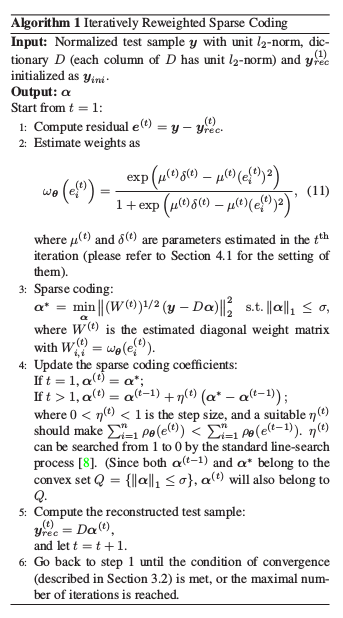

# Robust Sparse Coding for Face Recognition
## Abstract
1.  現今 sparse representation based Classification (SRC) 被成功應用在 face recognition 上
2.  在 SRC 中，test image 被以 training sample 的 sparse linear combination 表示。
    -   可以使用 l2-norm 和 l1-norm 的 residual 來測量 fidelity
    -   但這是假設 coding residual 是滿足 Gaussian 或 Laplacian 的分佈，可能不符合真實情況

3.  本篇論文提出一種新的方案，稱為 robust sparse coding (RSC)
    -   將 sparse coding 建模成 sparsity-constrained robust regression problem
    -   RSC 尋找 sparse-coding 的 maximum likelihood solution
        -   對於 occulusion 和 corruption 更 robust

## 1. Introduction
1.  sparse representation 為一項 powerful 的統計模型
    -   成功用於 image processing, face recognition 和 texture classification

2.  如同 image 能夠以 edge, line segment 等 structure 來作 coded
    -   sparse coding 從 over-complete dictionary 中選出 atoms 來 represent image
    -   coding coefficient vector 的 sparsity 可以用 l0-norm 來作 measure (l0-norm 是計算vector中的非0元素數量)
    -   由於 l0-norm 為 NP-hard, l1-norm 為較接近的作法

3.  一般情形下，sparse coding 可以 formulate 成

    -   y 為給定的 signal
    -   D 為 coding atoms 的 dictionary
    -   alpha 為 y 在 D 上的 coding vector

4.  Face Recognition (FR) 是在 computer vision 和 pattern recognition 上較有挑戰的問題
    -   存在的method: EigenFaces, Fisherfaces, SVM
    -   Wright 將 sparse coding 應用在 FR 上
        -   將 query image y 用 training samples 的 sparse linear combination 來表示 (採用 l1-norm minimization)

        -   SRC 會檢查看哪一個 class 的 training sample 可以帶來最小的 reconstruct error

5.  Sparse Coding 主要存在兩個 issues
    -   l1-norm 是否足以描述 signal sparsity
    -   l2-norm ||y-D*alpha||_2 <= epsilon 是否足以描述 signal fidelity

6.  對於 signal fidelity 做嘗試的 work 較少，但其實 fidelity 決定了給定的 signal y 是否由 dictionary D 完整表達
    -   從 maximum likelihood 的角度
        -  l2-norm 為假設 coding residual 是 Gaussian distribution
        -  l1-norm 為假設 coding residual 是 Laplacian distribution

7.  本篇論文提出 Robust Sparse Coding
    -   利用 MLE-like estimator 來設計 signal fidelity term
    -   將 minimization problem 轉換為 Iteratively reweighting sparse coding problem
    -   Section 2 將介紹 RSC model
    -   Section 3 則分析 Algorithm

## 2. Robust Sparse Coding (RSC)
### 2.1 The RSC model
1.  傳統 sparse coding model 與 LASSO problem 等價

    -   sigma > 0 為常數
    -   y = [y1;y2;y3,...,yn] 在 Rn 空間中為需要 coded 的 signal
    -   D = [d1,d2,...,dm] 在 Rnxm 空間中，為 dictionary
        -   dj 為第 j 行，第 j 個 atom
    
    -   alpha 是 coding coefficient vector

2.  在 FR 問題中
    -   dj 為 training face sample(或是 dimensionalty reduced feature)

3. 本篇論文提出 coding coefficient 的 MLE solution
    -   重新建立 dictionary D=[r1;r2;...;rn] (row vector)
    -   e = y-D*alpha = [e1;e2;...;en]
        -   ei 皆為 independently identically distributed，以 f_theta 作 PDF
        -   可得到 likelihood function L_theta
        -   
        -   MLE 則以 maximize 此 likelihood function 為目標
    
    -   object function
        -   

4.  通常假設 PDF f_theta 是
    -   symmetric, 凹口向上
    -   所以極小值落在 0

5.  solve 如上的 object function，可以得到 alpha 的 MLE solution
    -   如何取得 distribution (PDF)
    -   本篇論文不直接決定 rho_theta, 而是漸進地 reweighting

### 2.2 The distribution induced weights
1.  利用一階泰勒展開式去逼近 F_theta
    -   
    -   

2.  在 sparse coding 中，fidelity term 通常希望是 strict convex 的
    -   本篇論文以此方式逼近 residual term
    -   
        -   W 為對角矩陣, 沒有 cross term
    -   
        -   將原本的 problem 加上 weight
    -   

3.  weighting matrix 對角線上的元素是 assign 給每個 query image y 的 weight 
    -   藉由 SVM 中的 hinge loss function，指定如下的 weighting function
    -   
    -   由 rho_theta(0) = 0，可以得到
    -   

4.  weighted LASSO 有以下優點
    -   outliers(residual 較大的 pixels)會被 assign 較小的 weight，對 outliers 的 sensitivity 可以減少

5.  RSC model 的 convexity 會 depend on rho_theta(ei) 或 weight function w_theta(ei)
    -   如果令 w_theta(ei) 為 2，則 RSC 退化為原有的 sparse coding problem
    -   RSC model 用此 weight function 則將不 convex
    -   
    -   但是 Face Recognition 皆可以找到良好的 intialization，且下個 section 介紹的 RSC 皆可找到 local optimization。

## 3. Algorithm of RSC
1.  RSC 的實作可以是一個 iterative process
    -   每個 iteration 為一個 convex l1-minimization 問題

2.  本節將會介紹 iteratively reweighted sparse coding (IRSC) 來解決 RSC minimization

### 3.1 Iteratively reweighted sparse coding (IRSC)
1.  雖然在一般的 RSC model 只能達到 locally optimal solution，但在 face recognition 中可以由良好的 initialization 達到不錯的 performance

2.  當有 test face image y 時，要先估計 y 的 residual e 用以 initialize weight
    -   可以 initialize e 為 e = y - y_ini
    -   y_ini 為 observation y 的 initial estimation of true face
        -   可以先將 y_ini 設為所有 training images 的平均 y_ini = mD

3.  有了 intialized 的 y_ini，我們將可用 Iteratively Reweighted Sparse Coding 來解 RSC model。當 RSC 收斂時，即可用如同 SRC 的方式來分類 face image y

### 3.2 The convergence of IRSC
1.  因為 cost function 有下界且在每次 iteration 都會被 IRSC 作遞減，因此 IRSC procedure 會收斂

2.  收斂會在兩次相鄰的 iteration 的 weight 相差夠小時達到
    -   
    -   gamma 為一小正常數

### 3.3 Complexity analysis
1.  SRC 和本篇論文提出的 IRSC 主要是倚賴 sparse coding process
    -   如果 face feature 固定在 n 維，則 sparse coding model 的 complexity 則主要是在 dictionary atom 的數量 m 上

2.  l1-regularized sparse coding methods 的複雜度為 O(m^ep)
    -   ep 約為 1.5

3.  對於沒有 occlusion 的 FR， SRC 可以進行 sparse coding 一次並且用各個 class 的 residuals 來分類 face class，RSC 則可能需要數次 iteration 來完成 coding

4.  對於有 occulusion 或是 corruption 的 FR， SRC 會需要以單位矩陣來 code occluded 或是 corrupted pixels
    -   複雜度為 O((m+n)^ep)
    -   可能會使 SRC 在 occulusion 時的複雜度特別高

5.  本篇論文提出的 RSC 複雜度則為 O(k(m)^ep)
    -   k 為 iteration 數，受 outlier 數量影響
    -   若 outliers 數量少，則多半可在 2 個 iterations 完成。若 outlier 佔多個 percentage，則可能需要 10 個 iterations

6.  在有 occulusion 的情況， RSC 的複雜度遠低於 SRC。在 IRSC 的 iteration 中，甚至可以將 small weight 的 element yi 刪去(因為其很可能為 outlier)，進一步降低複雜度。
    -   在每次 iteraiton 平均會 delete 掉 30% 的 pixels

### Algorithm procedure
