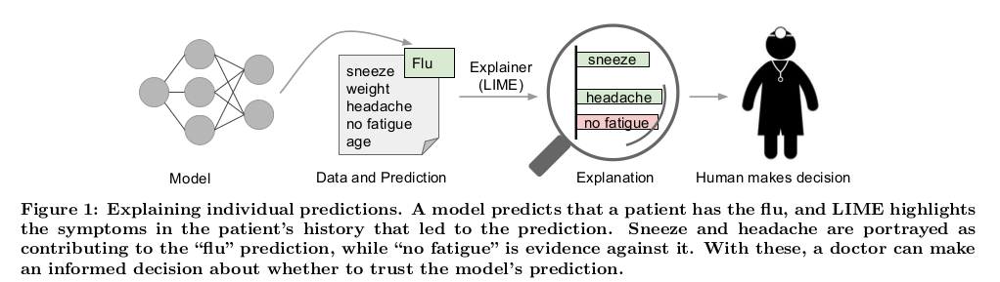
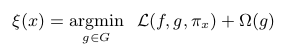
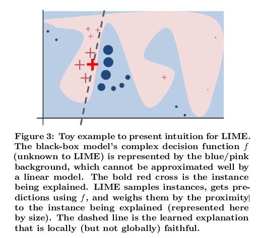

# "Why Should I Trust You?" Explaining the Predictions of Any Classifier
## Novelties, contributions, assumptions
1.  Propose LIME, explains the predictions of any classifier in an interpretable and faithful manner
2.  Propose a method to explain models by presenting representative individual predictions and their explanations in a non-redundant way, framing the task as a submodular optimization problem

## Questions and promising applications
1.  machine learning for medical diagnosis or terrorism detection
    -   should not be black box or blind faith

## Technical summary
1.  LIME
    -   an algorithm that can explain the predictions of any classifier or regressor in a faithful way, by approximating it locally with an interpretable model.
2.  SP-LIME
    -   a method that selects a set of representative instances with explanations to address the "trusting the model" problem, via submodular optimization

#### Desired Characteristics for Explainers
1.  hundreds or thousands of features significantly contribute to a prediction

2.  features that are globally important may not be important in the local context, and vice versa.

#### Interpretable Data Representation
1.  interpretable explanations need to use a representation that is understandable to humans

-   possible interpretable representation
for text classification is a binary vector indicating the presence or absence of a word
        
-   image classification, an interpretable representation may be a binary vector indicating the “presence” or “absence” of a contiguous patch of similar pixels (a super-pixel)

#### Fidelity-Interpretability Trade-off
1.  The domain of g is {0, 1} d , i.e. g acts over absence/presence of the interpretable components.
    -   Ω(g) be a measure of complexity
    -   Ω may be depth of decision tree
    -   may be the number of non-zero weights of linear model

2.  model being explained be denoted f:R^d → R. In classification, f(x) is the probability (binary indicator)
    -   L(f, g, πx ) be a measure of how unfaithful g is in approximating f
    -   minimize L(f, g, π x ) while having Ω(g) be low enough to be interpretable by humans

3.  This formulation can be used with different explanation families G, fidelity functions L, and complexity measures Ω.
    

#### Sampling for Local Exploration
1.  sample instances around x' by drawing nonzero elements of x' uniformly at random (where the number of such draws is also uniformly sampled)

2.  Given a perturbed sample z' ∈ {0, 1}^d' 
(which contains a fraction of the nonzero elements of x), recover the sample in the original representation z ∈ R^d and obtain f(z)

3.  optimize following formula and get an explanation ξ(x)
    

